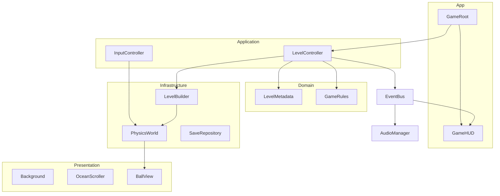
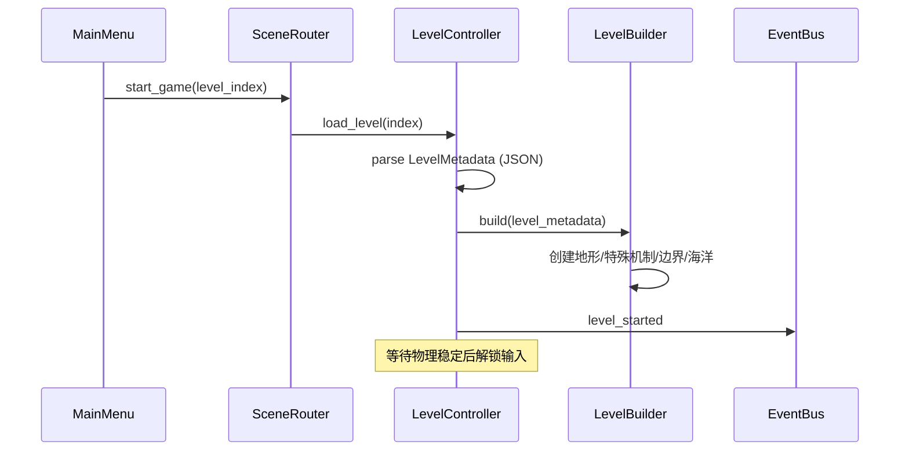

# LoveLetter Godot 跨平台重写技术方案

> 版本：v1.0  
> 基准项目：LoveLetter（Android Java + JBox2D，2013）  
> 目标引擎：Godot 4.x  
> 目标平台：Android、iOS、Web、Windows、macOS、Linux

---

## 1. 背景与目标

### 1.1 现状问题

| 问题 | 影响 |
|------|------|
| Ant + Java + API 7 | 无法上架现代应用商店 |
| 1200+ 行 `Constant.java` 硬编码关卡 | 维护、扩展、协作成本极高 |
| SurfaceView 手写游戏循环 | 线程同步脆弱，难以测试 |
| 仅 Android | 无法覆盖 iOS / Web / Desktop |
| 友盟 SDK + 过时权限 | 隐私合规风险 |

### 1.2 重写目标

1. **功能等价**：28 关玩法、物理手感、特殊机制、彩蛋（飞天模式）完整保留
2. **跨平台**：一套代码导出 6 类平台
3. **数据驱动**：关卡与物理配置外置，编辑器可维护
4. **可测试**：核心规则与物理参数可单元测试
5. **可演进**：后续加关卡、换皮、多语言不改核心架构

### 1.3 非目标

- 不做 3D 化或玩法大改
- 不引入后端服务（保持离线单机）
- 第一期不做关卡在线编辑器（预留 JSON 格式即可）

---

## 2. 技术选型

### 2.1 核心栈

| 层级 | 选型 | 版本建议 | 理由 |
|------|------|----------|------|
| 引擎 | Godot | 4.3+ | 2D 物理、多平台导出、Scene 工作流成熟 |
| 脚本 | GDScript | 内置 | 与引擎集成最好，迭代快；团队熟悉后可局部 C# |
| 物理 | Godot Physics 2D | 内置 | Box2D 衍生，API 与旧项目概念对齐 |
| 关卡数据 | JSON + Resource | — | 版本可控，CI 可校验，未来可接 Tiled |
| 存档 | `user://` + JSON | — | 跨平台统一路径 |
| 音频 | AudioStreamPlayer / AudioStreamPlayer2D | 内置 | 替代 MediaPlayer + SoundPool |
| 分析 | 可选 Firebase / 无 | — | 移除友盟，默认不采集 |

### 2.2 分辨率与适配策略

旧项目以 **800×480 横屏** 为设计基准，通过 `changeRatio()` 运行时缩放。

Godot 方案：

```
Project Settings:
  display/window/size/viewport_width  = 800
  display/window/size/viewport_height = 480
  display/window/stretch/mode         = canvas_items
  display/window/stretch/aspect       = expand
  display/window/handheld/orientation = landscape
```

- **逻辑坐标**始终使用 800×480，与旧 `Constant` 数值 1:1 对应，降低迁移误差
- **物理世界**使用 Godot 默认 **1 unit = 1 pixel**（旧项目 `RATE = 30 px : 1 m`，迁移时在 Builder 层统一换算）
- 各平台通过 Stretch + 黑边/扩展填充，不再运行时 mutate 全局常量

### 2.3 物理参数映射

| 旧项目 (JBox2D) | Godot Physics 2D | 迁移说明 |
|-----------------|------------------|----------|
| `GRATIVITY = 31.847` | `ProjectSettings physics/2d/default_gravity` | 按 RATE 换算后调参，以手感为准 |
| `TIME_STEP = 1/60`, `ITERA = 10` | `_physics_process(delta)` 固定 60 FPS | Godot 内置求解器，需 Playtest 微调 friction/restitution |
| `UP_VELOCITY = -15` | `linear_velocity.y = jump_impulse` | 跳跃冲量，配置在 `GameConfig` |
| `VELOCITY_RATE = 0.7` | 加速度输入缩放因子 | 配置在 `InputConfig` |
| `BALL_RADIUS = 8` | `CircleShape2D.radius = 8` | 直接映射 |
| Polygon 静态地形 | `StaticBody2D` + `CollisionPolygon2D` | 顶点来自 JSON |
| Sensor 检测 | `Area2D` 或 `monitoring = true` + `collision_layer` | 死亡线、Next、Gate 等 |
| PrismaticJoint (Car) | `PinJoint2D` + motor 或 `AnimatableBody2D` + 脚本 | 见 §5.4 |
| RevoluteJoint (Gear) | `PinJoint2D` / 旋转 `RigidBody2D` + motor | 见 §5.4 |

> **原则**：数值以保证手感一致为准，不做公式级 1:1 换算；建立「参考关卡回归测试清单」（第 1、6、7、13、21、27 关）。

---

## 3. 架构设计

### 3.1 分层模型（DDD 思想适配 Godot）

Godot 以 Scene 树为核心，不强行套用 JVM 式模块，但逻辑上保持依赖方向：

```
app/              → 场景入口、Autoload、UI 流程
application/      → 用例编排（开始关卡、过关、死亡、重试）
domain/           → 纯规则（进度、胜负条件、关卡元数据模型）
infrastructure/   → 物理构建、输入、音频、存档、资源加载
presentation/     → 视觉节点、动画、粒子、指纹特效
data/             → JSON 关卡、配置、本地化
```

**依赖规则**：

- `domain` 不引用 `Node`、`RigidBody2D` 等引擎类型
- `application` 依赖 `domain` 接口，通过 `infrastructure` 注入
- `presentation` 只负责显示，不含胜负判定

### 3.2 Autoload 单例

| 名称 | 职责 |
|------|------|
| `GameState` | 当前关卡索引、飞天模式、音乐开关 |
| `LevelProgress` | 最高通关关、存档读写 |
| `EventBus` | 解耦事件：`level_completed`、`player_died`、`cheat_activated` |
| `AudioManager` | BGM / SFX 统一控制 |
| `SceneRouter` | 主菜单 ↔ 游戏 ↔ 结局 场景切换 |

### 3.3 场景结构

```
res://
├── scenes/
│   ├── boot/Boot.tscn                 # 初始化、加载配置
│   ├── menu/MainMenu.tscn             # 主菜单
│   ├── game/GameRoot.tscn             # 游戏根（关卡容器）
│   ├── game/ui/GameHUD.tscn           # 暂停、重试（死亡弹窗）
│   └── ending/Ending.tscn             # 第 28 关结局字幕
├── scripts/
│   ├── domain/
│   ├── application/
│   ├── infrastructure/
│   └── presentation/
├── data/
│   ├── levels/                        # level_001.json … level_028.json
│   ├── game_config.tres               # 全局物理/输入参数
│   └── locale/
├── assets/
│   ├── textures/                      # 合并后的 atlas
│   ├── audio/
│   └── fonts/
└── tools/
    └── migrate/                       # Constant.java → JSON 导出脚本
```

### 3.4 运行时对象关系



---

## 4. 核心系统设计

### 4.1 游戏主循环

```gdscript
# GameRoot._physics_process
func _physics_process(delta: float) -> void:
    if _state == GameState.PLAYING:
        _input_controller.apply_to_ball(_ball_body)
        # Godot 物理步进由引擎驱动，无需手动 world.step()
    _ocean_scroller.scroll(delta)
```

| 旧项目 | Godot |
|--------|-------|
| `DrawThread` while + sleep(5) | 引擎 `_process` / `_physics_process` |
| 手动 `lockCanvas` | 场景树自动渲染 |
| `world.step(1/60, 10)` | `Engine.physics_ticks_per_second = 60` |

### 4.2 玩家（Spirit / Ball）

**节点结构**：

```
Ball (RigidBody2D)
├── CollisionShape2D (CircleShape2D, r=8)
├── Sprite2D (ball 纹理)
└── BallController (Script)
```

**行为规则**（`domain/GameRules.gd`）：

| 事件 | 条件 | 动作 |
|------|------|------|
| 跳跃 | 接地 **或** 飞天模式 | `linear_velocity.y = jump_impulse` |
| 左右移动 | 游戏进行中且非结局暂停 | 设置/修改 `linear_velocity.x` |
| 死亡 | 触碰 DeadLine Area2D | 触发 `player_died` |
| 过关 | 触碰 Next Area2D | 触发 `level_completed` |

**接地检测**：

- 旧项目：`ContactListener.isOnGround`
- Godot：`BallController` 监听 `body_entered` / `body_exited`，或用 `RayCast2D` 向下检测
- 推荐：**接触计数器**（`ground_contacts > 0`），与 Box2D persist/remove 语义接近

### 4.3 关卡加载流程



**LevelController 状态机**：

```
LOADING → PLAYING → DYING → DEAD_UI → RETRYING
                  → COMPLETING → NEXT_LEVEL
                  → ENDING (level 27)
```

### 4.4 输入系统

**抽象接口**（`domain/InputPort.gd`）：

```gdscript
class_name InputPort
extends RefCounted

func get_horizontal() -> float: pass
func is_jump_pressed() -> bool: pass
```

**平台实现**：

| 实现类 | 平台 | 左右 | 跳跃 |
|--------|------|------|------|
| `AccelerometerInput` | Android / iOS | 倾斜 X/Y 轴 | 触摸 |
| `KeyboardInput` | Desktop / Web | A/D 或 ←/→ | Space / 点击 |
| `TouchInput` | 通用 fallback | 虚拟按键（可选） | 触摸 |

**旧项目重力感应逻辑迁移**：

```gdscript
# 原 changeBallV：平板/手机轴向判断 isPingban
var accel := Input.get_accelerometer()
var tilt := accel.x if _is_tablet else accel.y
if abs(tilt) < sensor_threshold:
    return
ball.linear_velocity.x = -tilt * velocity_rate
```

桌面/Web 无加速度计时自动降级为 `KeyboardInput`。

### 4.5 音频

| 类型 | 旧 | Godot |
|------|-----|-------|
| BGM 循环 | MediaPlayer | `AudioStreamPlayer` + `stream.loop = true` |
| 跳跃音效 | SoundPool | `AudioStreamPlayer` one-shot 或 SFX pool |
| 音乐开关 | `PLAY_BACK_MUSIC` 静态变量 | `GameState.music_enabled` → `AudioManager` |

### 4.6 进度与存档

```json
// user://save.json
{
  "version": 1,
  "max_level_unlocked": 5,
  "music_enabled": true,
  "cheat_fly_mode": false
}
```

- 旧项目无持久进度，每次从第 1 关开始；Godot 版**建议保留**「从主菜单进入第 1 关」的原始体验，存档仅记录最高进度（可选功能，配置开关）

### 4.7 彩蛋：飞天模式

| 触发 | 1 秒内连续点击主菜单空白处 > 10 次 |
| 效果 | 任意位置可跳跃（不要求接地） |
| 提示 | Toast：「够啦，够啦。恭喜您已进入无敌飞天模式…」 |

实现：`GameState.cheat_fly_mode = true`，`GameRules.can_jump()` 增加 OR 条件。

---

## 5. 关卡与特殊机制

### 5.1 关卡清单

共 **28 关**（索引 0–27），对应旧 `Constant.CURRENT_LEVEL`。

| 关卡 | 索引 | 背景 | 特殊机制 |
|------|------|------|----------|
| 1–4 | 0–3 | bg_level1–4 | 字母地形 |
| 5 | 4 | bg_level5 | — |
| 6 | 5 | bg_level6 | **Car** 往复平台 |
| 7 | 6 | bg_level7 | **Gear** 双齿轮旋转 |
| 8 | 7 | bg_level8 | **Heads** 四个圆形障碍（静态） |
| 9–11 | 8–10 | bg_level9–11 | — |
| 12 | 11 | bg_level12 | 迷宫型字母地形 |
| 13 | 12 | background | **Bugs** 闪烁障碍（仅视觉+碰撞切换） |
| 14–20 | 13–19 | bg_level14–20 | — |
| 21 | 20 | bg_level21 | **Spring** 传送门（Sensor） |
| 22 | 21 | bg_level22 | — |
| 23–26 | 22–25 | bg_level23–26 | — |
| 27 | 26 | bg_level27 | **HustUnique** 结局触发 |
| 28 | 27 | bg_level28 | 最终字母关 |

> 注：旧代码中 `LevelManager` 对 level 12 使用 `Bugs`，索引为 12（第 13 关）；`Letters` 在 level 12 时不创建（第 13 关无字母地形，仅 bugs）。

### 5.2 通用关卡元素

每关（除特殊关）包含：

| 元素 | 类型 | 说明 |
|------|------|------|
| Letters | 静态多边形组 | `BODY_POINT[level]` 顶点 |
| NextIcon | Area2D Sensor | `NEXT_POSITION[level]`，碰撞后过关 |
| Sea / DeadLine | 视觉海洋 + Area2D | 底部滚动海洋 + 死亡线 |
| WorldBorder | StaticBody2D | 左右边界，宽度随背景图 |
| Background | Sprite2D | 关卡背景，支持 `xOffset/yOffset` |

### 5.3 关卡 JSON Schema

```json
{
  "$schema": "level.schema.json",
  "id": 1,
  "index": 0,
  "name": "Level 1",
  "background": {
    "texture": "res://assets/textures/bg_level1.png",
    "offset": [0, 0]
  },
  "ball_spawn": [83, 134],
  "next_portal": {
    "position": [725, 225],
    "half_size": [45, 27]
  },
  "terrain": {
    "polygons": [
      {
        "vertices": [[72, 147], [126, 148], [124, 154], [72, 152]]
      }
    ]
  },
  "world_border": {
    "left": 4,
    "right_offset_from_bg": 4
  },
  "special": {
    "type": "none"
  }
}
```

**`special.type` 枚举**：

| type | 附加字段 | 行为 |
|------|----------|------|
| `none` | — | 仅通用元素 |
| `car` | `path`, `speed`, `limits` | 第 6 关往复车 |
| `gear` | `big`, `small` 中心+半径+角速度 | 第 7 关齿轮 |
| `heads` | `circles: [{x,y,r}]` | 第 8 关圆形障碍 |
| `bugs` | `groups`, `cycle_frames`, `sprites` | 第 13 关闪烁 bug |
| `spring_gate` | `gate_polygon`, `teleport_velocity` | 第 21 关传送 |
| `hust_unique` | `polygon`, `logo_position`, `ball_reset` | 第 27 关结局 |
| `letters_only` | — | 第 28 关纯字母 |

### 5.4 特殊机制 Godot 实现

#### Car（第 6 关）

```
CarPlatform (AnimatableBody2D 或 RigidBody2D + PinJoint2D)
├── CollisionPolygon2D (car 形状)
├── Sprite2D
└── CarController.gd
    - motor 驱动沿 X 轴
    - translation < right_limit → 反向
    - translation > left_limit → 反向
```

旧参数：`CAR_SPEED=0.9375`, `CAR_LEFT_LIMIT=0.0625`, `CAR_RIGHT_LIMIT=-5.7`（关节空间，Builder 层换算）

#### Gear（第 7 关）

```
GearBig (RigidBody2D)
├── CollisionPolygon2D (BIG_CHILUN_POSI 合并或 Compound)
├── PinJoint2D → 固定锚点 (171, 167)
└── angular_velocity motor

GearSmall — 同理，锚点 (356, 309)，反向旋转
```

Sprite 旋转同步 `rotation = joint.get_angle()`。

#### Bugs（第 13 关）

- 5 组 bug 多边形 + 对应 sprite 位置
- 计时器每 `BUG_TIME_SHOW=200` 帧切换可见组
- 非当前组：`collision_layer = 0`（或 `disabled = true`）
- 当前组：淡入绘制 + 碰撞启用

#### Spring Gate（第 21 关）

- `GateArea` (Area2D, sensor)
- 球进入且接地：`ball.linear_velocity = Vector2(0, -25)`（按手感调整）

#### HustUnique（第 27 关）

状态机：

```
IDLE → CONTACTED → FADE_IN (alpha 0→255) → BALL_RESET → SCROLL_CREDITS → END
```

- 接触后：`gravity_scale = 0`，球速度归零
- alpha 满 255：球位置重置到 `BALL_POSI`
- 333 帧后：滚动 `the_end.png` 字幕，显示结局 UI
- **无 NextIcon**（旧代码 level 27 不创建 nextIcon）

### 5.5 数据迁移工具

`tools/migrate/export_levels.py`：

1. 解析 `Constant.java` 中 `BODY_POINT`、`NEXT_POSITION`、`POSITION_AND_SPEED_OF_BALL` 等
2. 输出 `data/levels/level_XXX.json`
3. 生成校验报告（顶点数、空关、索引连续性）

CI 步骤：`python tools/migrate/export_levels.py --verify`

---

## 6. 表现层设计

### 6.1 资源管线

| 步骤 | 说明 |
|------|------|
| 原始 PNG | 从 `res/drawable-nodpi/` 导入 |
| TextureAtlas | 合并 UI、球、按钮 → 减少 draw call |
| 背景 | 每关独立 800×480，不合并 |
| 压缩 | Android/iOS 用 ETC2/ASTC；Web 用 WebP/S3TC |

### 6.2 主菜单

- 背景渐变 + 标题 + 海洋滚动（复用 `OceanScroller`）
- 按钮：Play / Help / About / Music
- Help / About 弹层（TextureRect + 点击关闭）
- 指纹触摸特效：`FingerprintEffect`（CPUParticles2D 或 CanvasItem 绘制渐变圆）

### 6.3 死亡 UI

- 半透明遮罩 + `dead_bg` + Quit / Retry
- Quit → 主菜单；Retry → 重载当前关

### 6.4 相机

- 2D 固定相机，视口 800×480
- 无需跟随（旧项目无卷轴，背景固定）

---

## 7. 跨平台策略

### 7.1 导出矩阵

| 平台 | 优先级 | 输入 | 特殊处理 |
|------|--------|------|----------|
| Android | P0 | 加速度计 + 触摸 | `permissions` 仅 INTERNET（若无需则去掉） |
| iOS | P0 | 加速度计 + 触摸 | App Store 隐私声明 |
| Windows | P1 | 键盘 | — |
| Web | P1 | 键盘 + 点击 | 禁用加速度计；加载体积优化 |
| macOS / Linux | P2 | 键盘 | — |

### 7.2 平台差异封装

```
infrastructure/platform/
├── PlatformDetector.gd
├── AndroidExportPlugin.gd   # 可选：振动、保活
├── IOSExportPlugin.gd
└── WebExportPlugin.gd       # 全屏、键盘捕获
```

业务代码仅依赖 `InputPort` 工厂：

```gdscript
func create_input_port() -> InputPort:
    if OS.has_feature("mobile"):
        return AccelerometerInput.new()
    return KeyboardInput.new()
```

### 7.3 性能预算

| 指标 | 目标 |
|------|------|
| 帧率 | 60 FPS（物理与渲染） |
| 内存 | < 150 MB（移动端） |
| 冷启动 | < 3s（Android 中端机） |
| 包体 | Android APK < 30 MB（压缩后） |

---

## 8. 测试策略

### 8.1 单元测试（GdUnit4 或 Godot 内置）

| 测试对象 | 用例 |
|----------|------|
| `GameRules` | 未接地不可跳；飞天模式可跳 |
| `LevelMetadata` | JSON 解析、schema 校验 |
| `LevelProgress` | 存档读写、版本迁移 |

### 8.2 集成测试

- 每关「加载不报错」自动化：`LevelBuilder.build(level)` × 28
- 特殊关机制脚本单独测试（Car 换向、Bugs 周期）

### 8.3 手工回归清单

| 关卡 | 验证点 |
|------|--------|
| 1 | 基础跳跃、过关、死亡线 |
| 6 | 小车往复、可站上 |
| 7 | 齿轮旋转、球不被甩飞 |
| 13 | Bug 闪烁与碰撞同步 |
| 21 | 传送门弹射 |
| 27 | 结局动画、字幕滚动 |
| 主菜单 | 飞天彩蛋、音乐开关 |

### 8.4 物理手感对比

录制旧版/Android 与新 Godot 同关卡操作视频，对比：

- 跳跃高度
- 左右移动响应
- 死亡线判定边界

---

## 9. 工程规范

### 9.1 目录与命名

- Scene 文件：`PascalCase.tscn`
- 脚本：与 Scene 同名 `PascalCase.gd`
- JSON：`snake_case`，前缀 `level_001.json`
- 信号：过去式 `player_died`，不用 `die`

### 9.2 代码风格

- 遵循 [GDScript style guide](https://docs.godotengine.org/en/stable/tutorials/scripting/gdscript/gdscript_styleguide.html)
- `domain` 脚本禁止 `extends Node`，使用 `RefCounted`
- 魔法数字进 `game_config.tres` 或 JSON

### 9.3 版本控制

```
.gitignore:
  .godot/
  export/
  *.import (可选，团队约定)
```

---

## 10. 实施路线图

### Phase 0：工程初始化（1 周）

- [ ] 创建 Godot 4 项目，配置 800×480 横屏
- [ ] 搭建 Autoload、目录结构
- [ ] 导入核心美术资源、音频
- [ ] 编写 `export_levels.py`，导出第 1 关 JSON

### Phase 1：核心玩法 MVP（2 周）

- [ ] Ball + 物理 + 跳跃 + 接地检测
- [ ] 第 1 关地形加载 + Next + DeadLine
- [ ] KeyboardInput + 基础 GameHUD（Retry）
- [ ] 主菜单 → 游戏 → 返回

### Phase 2：全关卡迁移（3 周）

- [ ] 批量导出 28 关 JSON
- [ ] 实现 Car / Gear / Bugs / Spring / HustUnique
- [ ] 海洋滚动、世界边界
- [ ] 死亡 UI、过关切关

### Phase 3：体验对齐（1 周）

- [ ] AccelerometerInput + 平板轴向
- [ ] 音频、指纹特效、Help/About
- [ ] 飞天彩蛋
- [ ] 物理参数 Playtest 微调

### Phase 4：跨平台导出（1 周）

- [ ] Android / iOS 导出与签名
- [ ] Web / Windows 导出
- [ ] 各平台输入降级测试

### Phase 5：发布准备（1 周）

- [ ] 性能 profiling
- [ ] 商店素材、隐私政策
- [ ] 回归测试签字

---

## 11. 风险与应对

| 风险 | 概率 | 影响 | 应对 |
|------|------|------|------|
| 物理手感不一致 | 高 | 高 | 早期建立参考关回归；参数可热配置 |
| 旧关卡数据解析错误 | 中 | 高 | 自动化校验 + 可视化 debug 绘制碰撞形状 |
| iOS 加速度计权限/体验 | 中 | 中 | 提供触摸虚拟按键 fallback |
| Web 包体过大 | 中 | 中 | 纹理压缩、按需加载关卡资源 |
| Bugs 关碰撞与视觉不同步 | 中 | 中 | 统一由 `BugsController` 管理 layer 与 alpha |

---

## 12. 附录

### 12.1 旧 → 新模块映射

| 旧类 | 新组件 |
|------|--------|
| `LoveLetterActivity` | `MainMenu` + `GameRoot` + Autoload |
| `GameView` / `DrawThread` | `GameRoot` + 引擎循环 |
| `LevelManager` | `LevelController` + `LevelBuilder` |
| `Constant.java` | `data/levels/*.json` + `game_config.tres` |
| `Spirit` | `Ball` (RigidBody2D) |
| `Letters` | `TerrainBuilder` |
| `Sea` | `OceanScroller` + `DeadLineArea` |
| `NextIcon` | `NextPortalArea` |
| `ContactListener` | `BallController` 信号 + Area2D |
| `PicLoadUtil` | Godot ResourceLoader + Preload |
| `SoundUtils` | `AudioManager` |
| `MobclickAgent` | 移除或 Firebase（可选） |

### 12.2 关键配置默认值（初始迁移）

```gdscript
# game_config.tres
gravity_y = 980.0          # 待 playtest，由 31.847 * scale 推导
jump_impulse = -450.0      # 对应 UP_VELOCITY -15
velocity_rate = 0.7
sensor_threshold = 1.5
ball_radius = 8.0
physics_fps = 60
ocean_scroll_speed = 3.0   # OCEAN_MOVE_STEP
```

### 12.3 参考文档

- [Godot 4 Physics Introduction](https://docs.godotengine.org/en/stable/tutorials/physics/physics_introduction.html)
- [Godot Export](https://docs.godotengine.org/en/stable/tutorials/export/index.html)
- [GdUnit4 Testing](https://github.com/MikeSchulze/gdUnit4)

---

## 13. 决策记录

| 日期 | 决策 | 原因 |
|------|------|------|
| 2026-06 | 选用 Godot 4 而非 Unity/Flutter | 2D 物理益智 + 跨平台成本最优 |
| 2026-06 | GDScript 为主 | 引擎集成度、迭代速度 |
| 2026-06 | 保留 800×480 逻辑坐标 | 降低 Constant 迁移误差 |
| 2026-06 | JSON 关卡而非全 Scene 化 | 28 关数据量大，JSON 便于 diff 与工具链 |
| 2026-06 | 移除友盟 | 隐私合规、跨平台无对应 SDK |
